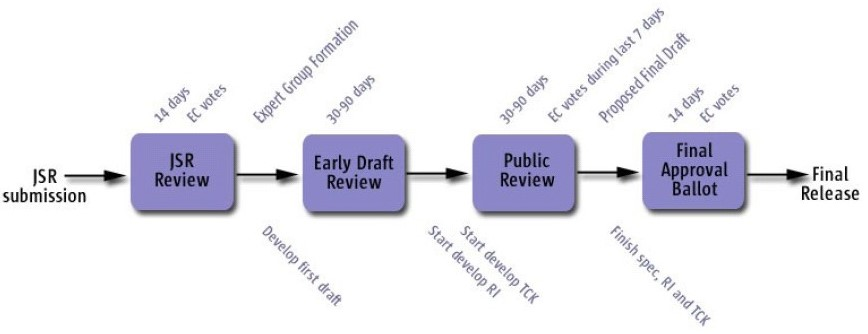

# Java Community Process (JCP) on GitHub

This document describes the policies and procedures for the repository creation in the JCP GitHub Organization

** Note:** This workspace is dedicated only for the content created related to the JSRs development via JCP Program. 

Examples of such content include:

* Specifications of the JSRs
* Meeting minutes from JSRs Expert Group meetings
* Source code for JSR usage examples
* RI/TCK source code (In some cases)

For getting repository for your project please read instrucions below and contact JCP PMO team (pmo@jcp.org)

* [Prepare you GitHub account](docs/GitHub_Account.md)
* [Request a repository](docs/Request_Repo.md)
* [Content transfer from java.net](docs/Transfer_from_java.net.md)

